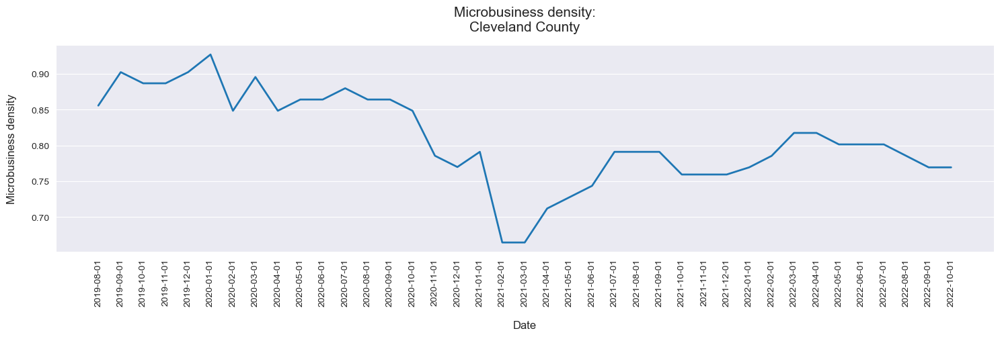
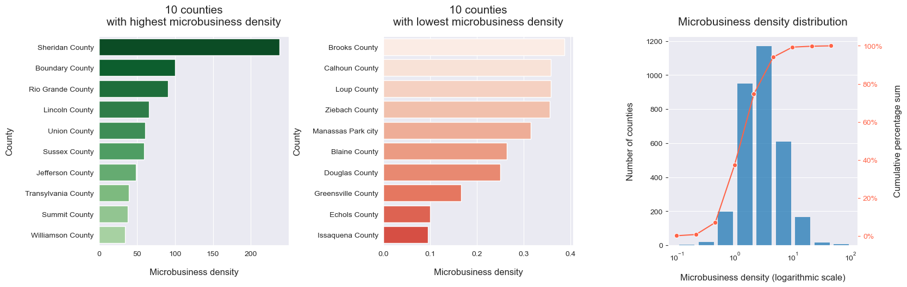
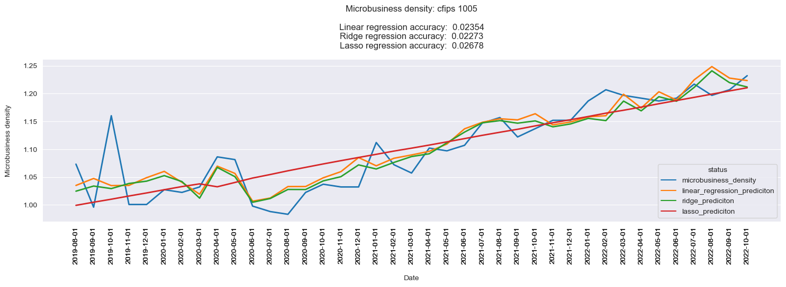

# Microbusiness density forecasting

## Project goal and overview
Hi!  It is based on Kaggle competition - [GoDaddy - Microbusiness Density Forecasting](https://www.kaggle.com/competitions/godaddy-microbusiness-density-forecasting/overview). Its main scope is to help American authorities predict amount of microbusinesses in particular regions of the USA, to be able to plan better geopolitical strategies. It is often hard to estimate number of this kind of enterpreneurships, because they may be too small to spot. And here comes data science, which - using other, more easily explorable factors - can help with this issue. Data used in this project comes from the competitions host and [Bureau of Labor Statistics](https://www.bls.gov/home.htm).  
  
 I started with some exploratory data analysis to have a look into the data:  

  

  

  
After feature engineering there was time to build machine learning models:  
 - Linear regression
 - Ridge regression
 - Lasso regression
  
which resulted in some cool predictions. Below we can see how it worked for a single county:

  

  
  
I used [SMAPE](https://en.wikipedia.org/wiki/Symmetric_mean_absolute_percentage_error) to measure accuracy of models.

## Motivation
I used this project as a playground to learn some machine learning regression tools.

## How to run the project
TODO

## Possible upgrades
More sophisticated ML tools can be used or there could be done more data analysis to find better correlations between data - for example lag features could be explored.
